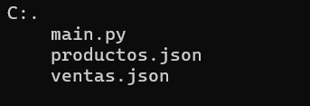

# PanCamp
## Descripción
Este es un programa para gestionar la compra y venta en una panaderia, donde tambien se puede tener contabilizados los productos.

## Estructura

## Archivos
|NOMBRE|DESCRIPCIÓN|
|--|--|
|main.py|Este es el archivo de Python que contiene el codigo para que el programa funcione. Este archivo está vinculado con 2 archivos json.|
|productos.json|En este archivo se almacenan toda la información sobre los productos.|
|ventas.json|Este archivo es el que contiene toda la informacion sobre las ventas realizadas y las compras a los proveedores.|

## tecnologías utilizadas
|PYTHON|JSON|
|--|--|
|||
## Contacto
E-mail: luismiguel110205@gmail.com
## Autor
- **Luis Miguel Caicedo Bermon**
